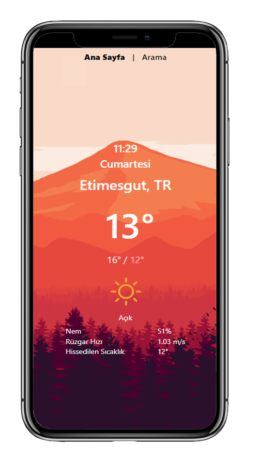
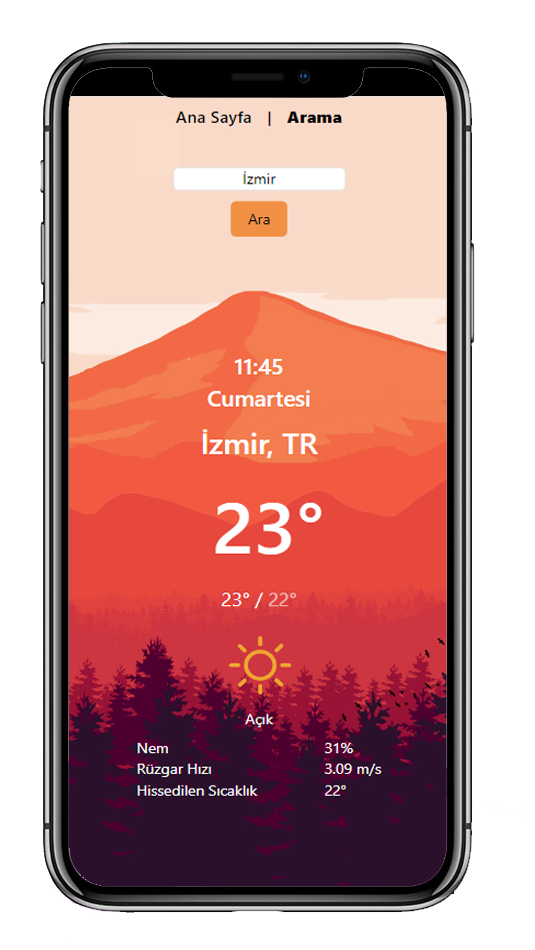
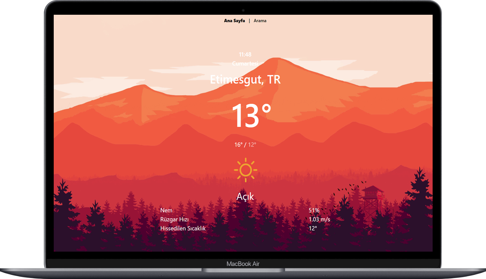
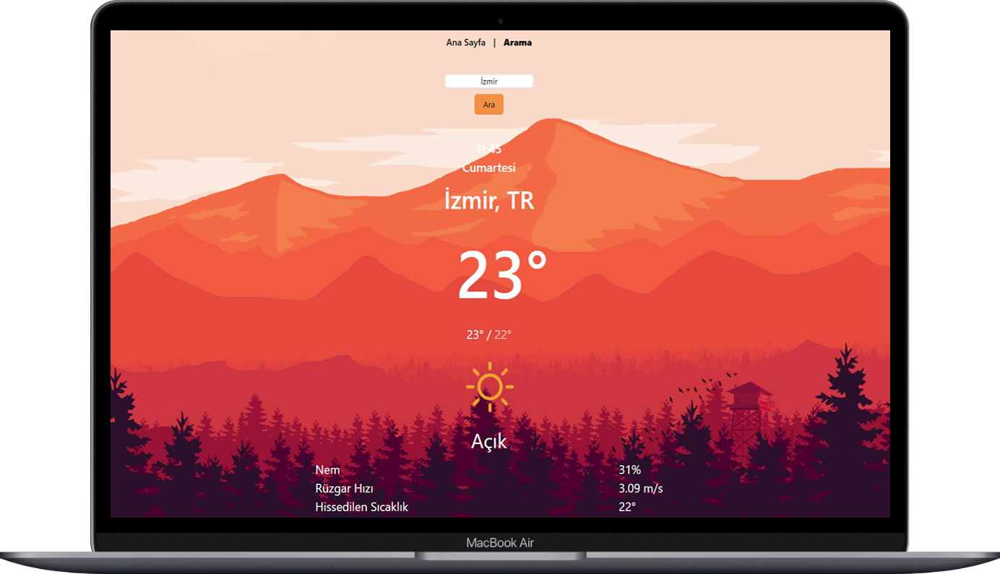

# Project Description
[EN]
Live time instant weather app. To access the weather using location, you need to allow location information. <br>
[TR]
Canlı zamanlı anlık hava durumu uygulaması. Konumu kullanarak hava durumuna erişmek için konum bilgisine izin vermeniz gerekir.
## Table of Contents

- [Project Description](#Project-Description)
- [Live Demo](#Live-Demo)
- [Installation](#Installation)
- [Technologies](#Technologies)
- [Project View](#Project-View)
  
## Live Demo

[](https://app.netlify.com/sites/alihan-vue-weatherapp/deploys) <br>
You can see the live demo <a href="https://alihan-vue-weatherapp.netlify.app/"> here. </a>

## Installation

```
- git clone https://github.com/alihandgrmnclr/Vue_Weather-Forecast.git
- cd weather
- npm install
- npm run dev
```

### Technologies

- Geolocation
- Vite
- Vuejs
- VueRouter
- Axios
- SCSS
- Tailwind CSS

## Project View

<div align="center">
  
  
</div>
<div align="center">
  
  
</div>
